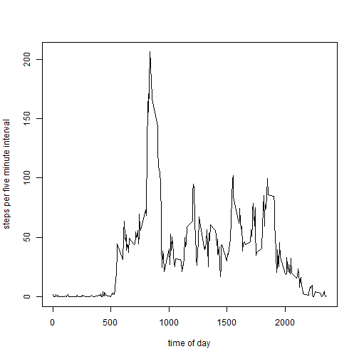

##Project Assignment 1 for Reproducible Research

Sidonia von Proff


First, I need to load the data into R Studio. Then I extract complete cases to see in how many rows there are NAs. The date Vector is in factor format ans has to be transformed into date format


```r
setwd("C:/Users/Sidonia/datasciencecoursera")
mydata <- read.csv("activity.csv")
mydata_complete <- mydata[complete.cases(mydata),]
mydata_na <- mydata[!complete.cases(mydata),]
nrow(mydata_na)
```

```
## [1] 2304
```

```r
nrow(mydata_na)/nrow(mydata)
```

```
## [1] 0.1311
```

```r
mydata$date1 <- strptime(mydata$date, format="%Y-%m-%d")
```
There are 2304 rows with NAs, which is 13,1% of the dataset.

###What is mean total number of steps taken per day?

To find that out, I first need to sum up the steps for each day and then 
calculate the mean. There are time intervals and whole days without information.
Whole days without data will be ignored, i.e. the result is the mean amount of
steps on days with data.


```r
daily <- aggregate(mydata$steps,list(mydata$date), sum, na.omit=T)
hist(daily[,2], breaks=10, xlab="Steps per day", main="")
```

 

```r
mean(daily[complete.cases(daily),2])
```

```
## [1] 10767
```

```r
median(daily[complete.cases(daily),2])
```

```
## [1] 10766
```
Mean and median are almost the same, indicating a rather symmetric distribution. 
However, there are some days with especially many steps, maybe days where the person went running.

###What is the average daily activity pattern?

By aggregating the data for each time interval of a day, I can get the daily pattern, which I will plot then.


```r
pattern <- aggregate(mydata_complete$steps, list(mydata_complete$interval), mean)
plot(pattern[,1],pattern[,2], type="l", xlab="time of day", ylab="steps per five minute interval")
```

 

```r
pattern[pattern[,2]==max(pattern[,2]),1]
```

```
## [1] 835
```
Hence, the 5-min interval with the most steps is the one of 8:35 in the morning.

###Missing data

There are some days with no entries. October and November have jointly 61 days. We check, whether all dates are in the dataset. Then we check, how many dates contain NAs.


```r
nrow(daily)
```

```
## [1] 61
```

```r
nrow(daily)-sum(!is.na(daily[,2]))
```

```
## [1] 8
```

For these 8 cases, one can use the average number of daily steps.


```r
daily$x[is.na(daily[,2])] <- mean(daily[complete.cases(daily),2])
hist(daily[,2], breaks=10, xlab="Steps per day", main="")
```

 

```r
mean(daily[complete.cases(daily),2])
```

```
## [1] 10767
```

```r
median(daily[complete.cases(daily),2])
```

```
## [1] 10767
```

How did the distribution change? Mean stays the same (median shifts slightly to mean) since I added only values identical to the mean. The distribution shifted to the mean, since there are now 8 additional days with average step values.

Regarding the original dataset (replacing the NAs there), one can use the average number of steps in this time inteval.


```r
for (i in 1:nrow(mydata)) {
    if (is.na(mydata$steps[i])) {
        mydata$steps[i] <- pattern[pattern[,1]==mydata$interval[i],2]
    }
}
```

##Differences between weekdays and weekends

For this investigation you need two subsets "weekdays" and "weekends".


```r
mydata$weekdays <- weekdays(mydata$date1)
Mo_Fr <- c("Montag","Dienstag","Mittwoch","Donnerstag","Freitag")
Sa_So <- c("Samstag","Sonntag")
mydata_wd <- subset(mydata, mydata$weekdays %in% Mo_Fr)
mydata_we <- subset(mydata, mydata$weekdays %in% Sa_So)
pattern_wd <- aggregate(mydata_wd$steps, list(mydata_wd$interval), mean)
plot(pattern_wd[,1],pattern_wd[,2], type="l", xlab="time of day (weekdays)", ylab="steps per five minute interval")
```

 

```r
pattern_we <- aggregate(mydata_we$steps, list(mydata_we$interval), mean)
plot(pattern_we[,1],pattern_we[,2], type="l", xlab="time of day (weekends)", ylab="steps per five minute interval")
```

 

The walking behaviour at the weekend differs from that on weekdays.
